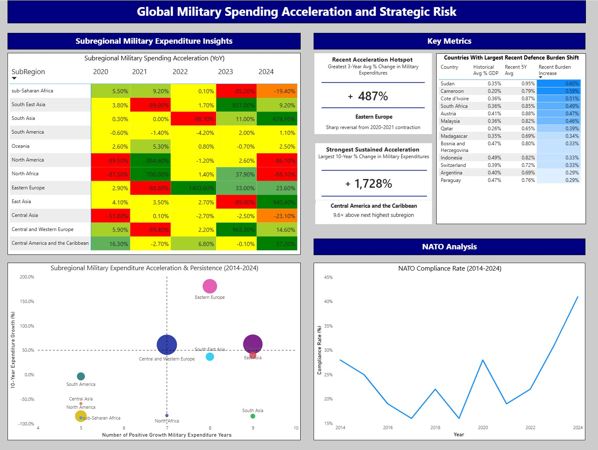
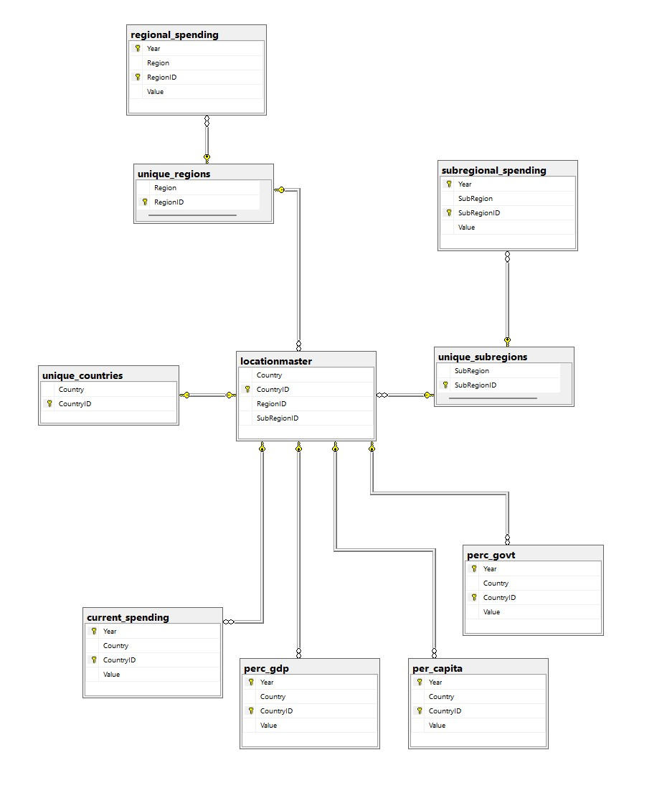

**Global Military Expenditure \& Strategic Risk Analysis**

**Project Overview:**

This project is a critical analysis of the Stockholm International Peace Research Institute (SIPRI) Military Expenditure Database. It aims to uncover insights and trends related to regional, subregional, and national military expenditure using analytical tools such as Excel, SQL, and Power BI.

**Dashboard Preview:**

**Project Objectives:**

The main objectives of this project include:
* Analyze global military expenditure trends
* Identify regional and subregional accelerations in military expenditure
* Examine changes in NATO compliance rates and burden sharing
* Display key insights and trends in an analytical and dynamic dashboard

**Tools \& Technologies:**

Key tools and technologies used in analysis include:
* Excel
* Power Query
* SQL
* Power BI
* SIPRI Military Expenditure Database
  
**Project Workflow:**

The project began with the raw SIPRI Military Expenditure dataset, following that:
* Power Query cleaning and transformation
* Separation of tables into individual CSV files
* SQL relational database design
* SQL analysis and querying
* Power BI dashboard development
* Microsoft Word brief/report of analysis

**Database Structure:**

**Key Analytical Techniques:**

Excel:
* Table
* Power Query
* Conditional formatting (Heatmaps)

SQL:
* Relational database design (PKs, FKs, ALTER)
* Common table expressions (CTEs)
* Window functions
* LAG()
* CASE statements
* Conditional aggregation
* YoY growth calculations

Power BI:
* Conditional formatting
* KPI development
* Bubble chart
* Line chart
* Interactive Table

**Key Findings:**
* Eastern Europe, Central and Western Europe, and South East Asia experienced the strongest post-2020 military spending acceleration
* NATO member spending compliance rate improved substantially following 2022 (nearly doubled)
* Several subregions such as South East Asia, East Asia, and Oceania displayed sustained long-term defence burden growth relative to economic output
* Defence/military expenditure acceleration is increasingly concentrated around geopolitical hotspots

**Files Included:**
* CSV folder
* SQL queries folder
* Intelligence briefing report (.docx)
* Raw dataset (.xlsx)
* Cleaned dataset (.xlsx)
* Supporting analysis dataset (.xlsx)
* Power BI dashboard (.pbix)
* README
* ERD screenshot (.jpg)

**Future Improvements:**
* Integration of geopolitical event datasets to further enhance analysis and reveal key insights
* Expansion of country-level analysis to supplement report briefing (i.e. focus on one particular subset of countries)

